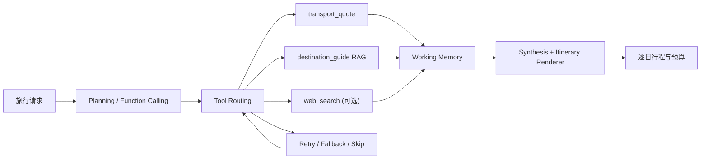

# Travel Planner Agent · LLM Tool-Using Agent System

[](https://github.com/l1cr0000-dev/llm-tool-using-agent-system/actions/workflows/ci.yml)
[](pyproject.toml)
[](https://langchain-ai.github.io/langgraph/)

一个可运行、可测试的旅行计划编排 Agent。用户输入出发地、目的地、天数、预算与旅行偏好，系统会通过 **Planning → Tool Routing → Execution → Recovery → Synthesis** 生成逐日景点、餐厅、交通选择与单人费用计划。

> 作品集定位：展示 LLM Function Calling、RAG、Tool Calling、状态管理、容错恢复与可复现实验，而不是一个静态的旅行推荐页面。

## 为什么这个项目值得展示

| 能力 | 实现方式 | 可验证证据 |
| --- | --- | --- |
| 多步 Agent 编排 | LangGraph `StateGraph` 显式管理 planner、router、executor、recovery、synthesizer | 节点级 trace 与集成测试 |
| 结构化 Tool Calling | DeepSeek / OpenAI-compatible Function Calling 生成 JSON Schema 约束的执行计划 | 本地 schema 校验与单元测试 |
| 旅行 RAG | 目的地知识库检索景点、餐厅、票价和日均成本 | 可替换的 `travel_kb/destinations.json` |
| 动态工具选择 | 交通报价、目的地 RAG、Web Search、计算器、天气、时间工具统一注册 | 离线端到端工具路由测试 |
| 执行稳定性 | Query Rewrite → Retry → 语义安全 fallback → 明确跳过 | working memory 与可观察 trace |
| 评测与成本意识 | 任务拆解、工具选择 F1、稳定性、估算调用成本与误差分类 | 版本控制的 benchmark / 报告命令 |

当前包含 **20 项自动化测试**，GitHub Actions 在 Python 3.11 与 3.12 上验证。

## 30 秒体验

```bash
git clone https://github.com/l1cr0000-dev/llm-tool-using-agent-system.git
cd llm-tool-using-agent-system
python -m pip install -e ".[dev]"

tool-agent travel 北京 上海 \
  --days 3 \
  --budget 4500 \
  --interests 美食,城市 \
  --offline
```

输出会包含：

- 往返交通的推荐与备选方案
- 每天上午 / 下午景点与餐厅建议
- 单日费用、交通费用、总计与预算差额
- 可审计的本地 RAG 数据来源与费用估算说明

查看完整示例：[上海 3 日行程输出](docs/travel-demo.md)。离线演示覆盖北京、上海、杭州、成都、三亚。

## Agent 架构



旅行功能保持了通用 Agent 的图式结构：Planner 选择工具，Router 串行执行，工具结果写入 working memory，Recovery 管理失败，最后由 Synthesizer 和行程渲染器汇总输出。

## 数据与边界

- `transport_quote` 使用城市坐标和透明公式给出单程人均交通估算；**不等同于实时票价**。
- `destination_guide` 从本地旅行知识库检索景点、餐厅、票价与日均成本；新增城市只需扩充同一 JSON Schema。
- 请求包含“最新”时，Planner 会增加 `web_search`；配置 `TAVILY_API_KEY` 后可补充实时信息。
- 出行前必须以官方渠道、实际交通和餐厅预订信息为准。

这些边界被显式保留，是为了避免把静态样例成本误写成实时旅游报价。

## 运行方式

### 旅行编排 Agent

```bash
tool-agent travel 上海 北京 --days 3 --budget 4500 --interests 历史,美食 --offline
```

### 通用 Tool-Using Agent

```bash
tool-agent run "计算 (18 + 24) / 6，并解释结果" --offline
tool-agent run "查询北京当前天气，并结合当地时间判断是否适合户外跑步"
tool-agent run "LangGraph 和 Dify 的 agent 架构差异是什么？" --stream
```

### 评测与测试

```bash
tool-agent evaluate --offline --output evaluation/results/agent-report.json
python -m pytest -q
```

如需真实 LLM / Web Search，在 `.env` 中配置：

```env
DEEPSEEK_API_KEY=your-deepseek-api-key
DEEPSEEK_MODEL=deepseek-chat
TAVILY_API_KEY=your-tavily-api-key
```

## 评测与 Dify 对照

项目提供相同任务集下的 Pipeline / Dify 对照框架，评测：

1. 任务拆解是否充分；
2. 工具选择 F1；
3. 工具调用成功率；
4. 按透明价格卡估算的调用成本；
5. `configuration`、`external_dependency`、`retrieval_miss`、`routing`、`tool_execution` 五类错误。

详见 [评测方法](docs/evaluation.md) 和 [Dify Workflow 草案](dify/llm_tool_agent_comparison.yml)。Dify 结果需由相同任务集的真实工作流运行产生，仓库不虚构对比数据。

## 项目文档

- [旅行 Agent 设计](docs/travel-agent.md)
- [总体架构与恢复策略](docs/architecture.md)
- [评测方法与误差分析](docs/evaluation.md)
- [离线旅行演示](docs/travel-demo.md)

## 简历表述（可直接使用）

**中文**

> 设计并实现基于 LangGraph 的旅游计划编排 Agent，将出发地、目的地、预算与偏好拆解为交通报价、目的地 RAG 和可选 Web Search 调用；通过 Function Calling 约束规划输出，生成逐日景点、餐厅与人均预算。实现 working memory、query rewrite、retry 与语义安全 fallback，并构建覆盖任务拆解、工具选择、执行稳定性和调用成本的评测框架；20 项自动化测试在 Python 3.11/3.12 CI 中通过。

**English**

> Built a LangGraph travel-planning agent that decomposes origin, destination, budget, and interests into transport, destination-RAG, and optional web-search tool calls. Enforced structured planning with Function Calling, produced day-by-day attraction, restaurant, and per-person cost itineraries, and added working memory, retries, semantic fallbacks, and an evaluation harness for decomposition, tool selection, stability, and estimated cost. Verified with 20 automated tests on Python 3.11/3.12 CI.

## License

MIT
