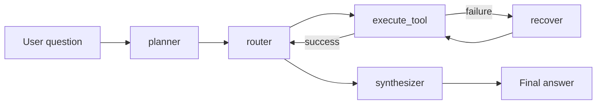

# LLM Tool-Using Agent System

一个面向作品集展示的 Python / LangGraph / DeepSeek / RAG / Tool Calling 项目。系统把复杂问题拆成 `planning -> tool selection -> execution -> synthesis` 多步流程，并通过 working memory 在步骤之间传递结构化上下文。

## Features

- LangGraph `StateGraph` 编排：planner、router、execute_tool、recover、synthesizer；DeepSeek Planner 使用 Function Calling 生成受 JSON Schema 约束的执行计划。
- 多工具路由：web search、calculator、knowledge base RAG、time、weather。
- 旅行编排 Agent：根据出发地、目的地、天数、预算和偏好，编排逐日景点、餐厅、交通方案与人均费用。
- Working memory：每步工具调用都落成结构化记录，供后续步骤和最终综合使用。
- Failure recovery：query rewrite、retry、语义安全的 fallback tool；没有可信 fallback 时显式跳过并在综合答案中说明缺失信息。
- CLI trace：可以直接看到规划、工具选择、执行、恢复和最终答案。
- Dify 对照：提供 low-code workflow YAML、统一评测数据格式和误差分析报告。

## Setup

```bash
cd /Users/lcr_ljw/agent/14-llm-tool-agent
uv venv --python 3.11
uv pip install -e ".[dev]"
cp .env.example .env
```

配置 `.env`：

```env
DEEPSEEK_API_KEY=your-deepseek-api-key
DEEPSEEK_MODEL=deepseek-chat
TAVILY_API_KEY=your-tavily-api-key
```

没有 `DEEPSEEK_API_KEY` 时，CLI 会使用 heuristic fallback，以便离线展示完整 agent trace。没有 `TAVILY_API_KEY` 时，web search 会返回结构化失败并触发 recovery/fallback。

## Run

```bash
python -m tool_agent run "查询北京当前天气，并结合当地时间判断是否适合户外跑步"
```

查看节点级更新：

```bash
python -m tool_agent run "LangGraph 和 Dify 的 agent 架构差异是什么？" --stream
```

安装后也可以使用脚本入口：

```bash
tool-agent run "计算 (18 + 24) / 6，并解释结果"
```

生成旅游计划（离线 RAG 演示支持北京、上海、杭州、成都、三亚）：

```bash
tool-agent travel 上海 北京 --days 3 --budget 4500 --interests 历史,美食 --offline
```

输出包含逐日景点与餐厅、交通备选、每人总预算及超支提醒。加入“最新”并配置 `TAVILY_API_KEY` 后，Planner 会额外调用 Web Search 补充实时信息。

需要完全离线地演示主链路时，附加 `--offline`（使用启发式 planner，并禁用联网搜索凭据）：

```bash
tool-agent run "从知识库解释 LangGraph" --offline
```

运行版本控制的评测集，并输出任务拆解、工具选择、稳定性与成本指标：

```bash
tool-agent evaluate --output evaluation/results/agent-report.json
```

在 Dify 中配置与 `dify/llm_tool_agent_comparison.yml` 对应的工具后，按同一批任务填写 `evaluation/dify_results_template.json`，即可生成对照报告：

```bash
tool-agent evaluate \
  --dify-results evaluation/dify_results.json \
  --output evaluation/results/comparison-report.json
```

## Demo Questions

```text
查询北京当前天气，并结合当地时间判断是否适合户外跑步
```

```text
计算 128 * 37 / 16，并说明计算过程
```

```text
从知识库解释 LangGraph 为什么适合 stateful agent workflow
```

```text
搜索 LangGraph 的最新信息，并结合知识库总结它和 Dify 的差异
```

```text
现在纽约几点？如果我要和北京同事开会，需要注意什么？
```

## Architecture



更多说明见 `docs/architecture.md`。

旅行 Agent 的工具、RAG 数据和费用计算规则见 `docs/travel-agent.md`。

## Test

```bash
python -m pytest
```

测试覆盖 calculator 安全计算、RAG 检索、time 时区解析、weather API 解析、working memory、router、recovery 和 fake graph 集成流程。
GitHub Actions 会在 Python 3.11 和 3.12 上自动运行该测试套件。

## Dify Comparison

`dify/llm_tool_agent_comparison.yml` 是一个可复现的 Dify workflow 草案，用 low-code 节点表达同一类流程：Start -> Planning LLM -> Tool/RAG/Time/Weather -> Synthesis Answer。

评测设计、JSON 结果格式与误差分析见 `docs/evaluation.md`。对照结论：

- Dify 更适合快速搭建、可视化调试和非工程角色协作。
- LangGraph 更适合代码审查、单元测试、复杂状态控制、可插拔 recovery 策略和可观测 trace。

## Resume Bullets

- Built a LangGraph-based LLM agent that decomposes user tasks into planning, tool routing, execution, recovery, and synthesis stages.
- Implemented a multi-tool architecture with Tavily search, safe calculator, local RAG, time lookup, and Open-Meteo weather retrieval.
- Designed working memory and failure recovery with query rewrite, retry, and fallback tool routing.
- Compared code-based LangGraph orchestration with a Dify low-code workflow DSL for architecture trade-off analysis.
- Built a reproducible evaluation harness measuring task decomposition, tool-selection F1, execution stability, and estimated call cost, with categorized error analysis.
- Extended the agent into a travel itinerary orchestrator that routes transport pricing and destination RAG, then produces day-by-day attraction, restaurant, and budget plans.
