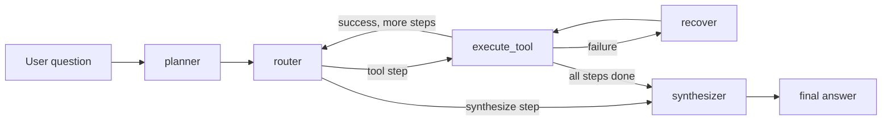

# LLM Tool-Using Agent System Architecture

## Pipeline

The DeepSeek planner requests a `create_execution_plan` Function Call and
validates the returned schema locally before the router reads it. This keeps
the model's tool choice structured while retaining a text-JSON fallback for
OpenAI-compatible models that do not support forced tool selection. DeepSeek's
official API documents `tools` and named `tool_choice` for this pattern.

## State

The graph state carries `question`, `plan`, `current_step`, `selected_tool`, `tool_input`, `tool_results`, `working_memory`, `retry_count`, `final_answer`, and `trace`.

`working_memory` is the cross-step handoff mechanism. Each successful or failed tool call is recorded with step id, objective, tool name, structured data, and error text. The synthesizer receives only that explicit memory plus the original question and plan.

## Tools

- `web_search`: Tavily-backed search. If `TAVILY_API_KEY` is missing, it returns a structured failure so recovery can demonstrate fallback behavior.
- `calculator`: safe AST-based arithmetic evaluator.
- `knowledge_base`: local markdown/text keyword retrieval.
- `get_time`: Python standard-library time lookup with common city-to-timezone mappings.
- `get_weather`: Open-Meteo geocoding plus current weather forecast. It does not require an API key.

## Recovery

When a tool fails or returns no usable result, the graph enters `recover`.

1. First failure: rewrite the query by adding a reliability hint, then retry the same tool.
2. Second failure: switch only between semantic peers, `web_search <-> knowledge_base`.
3. For calculator, time, and weather calls there is no unrelated fallback; the failed step is skipped and synthesis reports the gap.
4. Every recovery decision is appended to `trace`.

## Dify Comparison

The Dify workflow in `dify/llm_tool_agent_comparison.yml` mirrors the same conceptual flow with visual nodes. The comparison highlights where Dify is faster for low-code prototyping and where LangGraph is stronger for testable state transitions, custom recovery policy, and code review.
